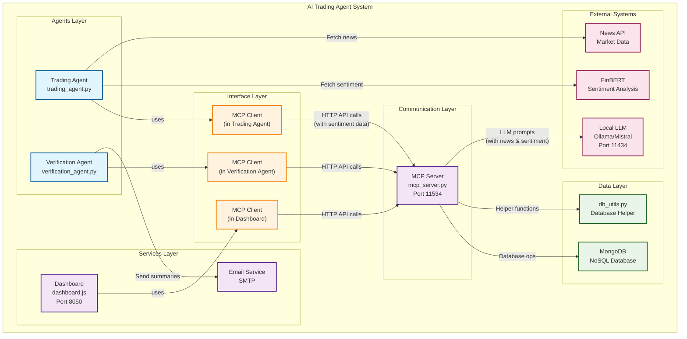

# AI Trading Agent System 🧠💹


An intelligent, agentic trading system featuring LLM-powered portfolio generation, automated trade verification, and real-time visualization. The system uses a Model Context Protocol (MCP) server for inter-agent communication and MongoDB for scalable data storage.

## 🎯 Key Features

- **🤖 LLM-Powered Trading**: Uses local Mistral LLM for dynamic portfolio generation
- **📈 Sentiment Analysis**: FinBERT-based sentiment filtering for news-driven decisions
- **🏗️ Agentic Architecture**: Decoupled agents communicating via MCP protocol
- **📊 Real-Time Dashboard**: Interactive visualization of portfolio performance
- **📧 Automated Verification**: Email summaries and trade verification
- **🗄️ Scalable Storage**: MongoDB database with concurrent access support

## 🏗 System Architecture

### 📊 Architecture Overview



## 📁 Project Structure

```
AItradingagent/
├── README.md                    # High-level overview & quick start
├── docs/                        # 📚 Dedicated documentation directory
│   ├── MCP_GUIDE.md            # MCP server technical guide
│   ├── DATABASE_GUIDE.md       # MongoDB setup & operations
│   └── API_REFERENCE.md        # Complete API documentation
├── utils/                       # 🔧 Code utilities only
├── agents/                      # 🤖 Trading agents
├── services/                    # 📊 Dashboard & services
└── tests/                       # 🧪 Test suite
```

## 🚀 Quick Start

### 1. **Install MongoDB**
```bash
# macOS
brew tap mongodb/brew && brew install mongodb-community
brew services start mongodb-community

# RHEL/Fedora
sudo dnf install -y mongodb mongodb-server
sudo systemctl start mongod && sudo systemctl enable mongod
```

### 2. **Install Dependencies**
```bash
pip install -r requirements.txt
```

### 3. **Set Up Local LLM**
```bash
# Install and run Ollama with Mistral
curl -fsSL https://ollama.ai/install.sh | sh
ollama pull mistral
ollama run mistral
```

### 4. **Configure Environment**
```bash
export NEWSAPI_KEY="your_news_api_key"        # Required
export EMAIL_USER="your@gmail.com"            # Optional
export EMAIL_PASS="your_app_password"         # Optional
```

### 5. **Test & Run**
```bash
# Test the setup
python tests/test_db_integration.py

# Start all services
python aitrading.py start

# Access dashboard
open http://localhost:8050
```

## 🔄 System Workflow

1. **Trading Agent** generates 25 symbol recommendations (20 stocks, 5 crypto) using LLM via MCP
2. **Trading Agent** fetches news and calculates sentiment using FinBERT
3. **Trading Agent** filters out symbols with negative sentiment
4. **Trading Agent** asks LLM via MCP for portfolio allocations with sentiment context
5. **Trading Agent** executes trades (80% stocks, 20% crypto) and saves to database via MCP
6. **Dashboard** displays real-time portfolio and trade data from database
7. **Verification Agent** queries database for unverified trades and sends email summaries

## 📚 Documentation

### Technical Guides
- **[MCP Server Guide](docs/MCP_GUIDE.md)** - MCP architecture, API endpoints, and protocols
- **[Database Guide](docs/DATABASE_GUIDE.md)** - MongoDB setup, schema, and operations
- **[API Reference](docs/API_REFERENCE.md)** - Complete API documentation

### Component Documentation
- **[Trading Agent](agents/README.md)** - LLM integration and sentiment analysis
- **[Dashboard](services/README.md)** - Visualization and monitoring
- **[Testing](tests/README.md)** - Test suite and validation

## 🛠 Development

### System Control
```bash
# Start all services
python3 aitrading.py start

# Stop all services
python3 aitrading.py stop

# Check logs
tail -f logging/*.log
```

### Adding Components
1. Create new agent in `agents/` directory
2. Use `MCPClient` for communication
3. Follow existing patterns for error handling
4. Add tests in `tests/` directory

## 🐛 Basic Troubleshooting

### Quick Checks
```bash
# MongoDB running?
mongosh --eval "db.runCommand('ping')"

# MCP server running?
curl http://localhost:11534/api/trades

# LLM running?
curl http://localhost:11434/api/tags
```

### Common Issues
- **MongoDB not found**: Install MongoDB first
- **Port conflicts**: Check if ports 8050, 11534, 11434 are available
- **Email issues**: Use Gmail App Password, not regular password

For detailed troubleshooting, see [Database Guide](docs/DATABASE_GUIDE.md) and [MCP Guide](docs/MCP_GUIDE.md).

## 🔮 Future Enhancements

- **Real Trading Integration**: M1 Finance API for live trading
- **Advanced Analytics**: ML models for portfolio optimization
- **Risk Management**: Automated risk assessment
- **Mobile Dashboard**: React Native mobile app
- **Backtesting**: Historical performance analysis

## 📄 License

MIT License - see LICENSE file for details.
