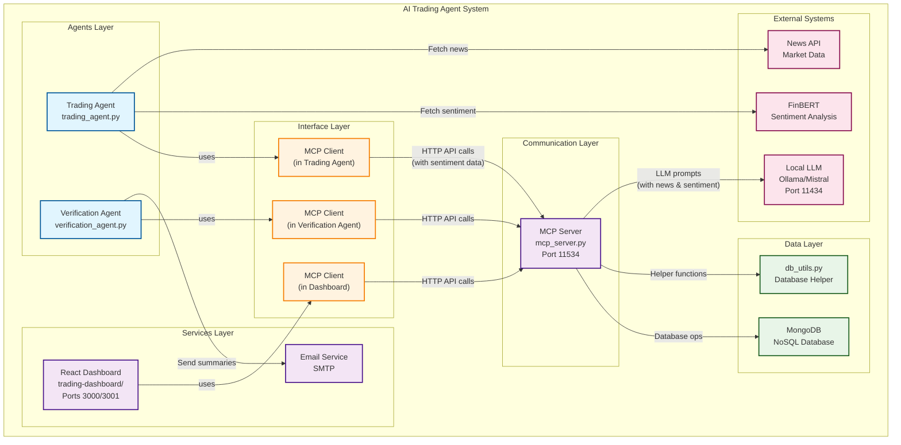

# AI Trading Agent System 🧠💹


An intelligent, agentic trading system featuring LLM-powered portfolio generation, automated trade verification, and real-time visualization. The system uses a Model Context Protocol (MCP) server for inter-agent communication and MongoDB for scalable data storage.

## 🎯 Key Features

- **🤖 LLM-Powered Trading**: Uses local Mistral LLM for dynamic portfolio generation
- **📈 Sentiment Analysis**: FinBERT-based sentiment filtering for news-driven decisions
- **🏗️ Agentic Architecture**: Decoupled agents communicating via MCP protocol
- **📊 Modern React Dashboard**: Interactive trading interface with real-time portfolio visualization
- **📧 Automated Verification**: Email summaries and trade verification
- **🗄️ Scalable Storage**: MongoDB database with concurrent access support

## 🏗 System Architecture

### 📊 Architecture Overview



## 📁 Project Structure

```
AItradingagent/
├── README.md                    # High-level overview & quick start
├── aitrading.py                 # 🎛️ Main system controller (start/stop/status/setup)
├── docs/                        # 📚 Dedicated documentation directory
│   ├── MCP_GUIDE.md            # MCP server technical guide
│   ├── DATABASE_GUIDE.md       # MongoDB setup & operations
│   └── API_REFERENCE.md        # Complete API documentation
├── utils/                       # 🔧 Code utilities
│   ├── system_setup.py         # Automated dependency installation
│   ├── db_utils.py             # Database operations
│   └── mcp/                    # MCP client/server components
├── agents/                      # 🤖 Trading agents
│   ├── trading_agent.py        # Main trading logic
│   └── verification_agent.py   # Trade verification
├── services/                    # 📊 Dashboard & services
│   └── trading-dashboard/      # React.js trading interface
├── tests/                       # 🧪 Test suite
└── requirements.txt            # Python dependencies
```

## 🚀 Quick Start

### 1. **Automated Setup (Recommended)**
```bash
# One-command setup - installs all dependencies automatically
python3 aitrading.py setup
```
This automatically installs:
- **MongoDB** (database)
- **Node.js & npm** (for React dashboard)
- **Python packages** (from requirements.txt)
- **React dependencies** (dashboard components)

### 2. **Manual Setup (Alternative)**
```bash
# Install MongoDB
# macOS: brew tap mongodb/brew && brew install mongodb-community
# Linux: sudo dnf install -y mongodb mongodb-server
# Windows: Download from mongodb.com

# Install Python dependencies
pip install -r requirements.txt

# Install Node.js dependencies for dashboard
cd services/trading-dashboard && npm install && cd ../..
```

### 3. **Set Up Local LLM**
```bash
# Install and run Ollama with Mistral
curl -fsSL https://ollama.ai/install.sh | sh
ollama pull mistral
ollama run mistral
```

### 4. **Configure Environment**
```bash
export NEWSAPI_KEY="your_news_api_key"        # Required
export EMAIL_USER="your@gmail.com"            # Optional
export EMAIL_PASS="your_app_password"         # Optional
```

### 5. **Check System Status**
```bash
# Verify all dependencies are ready
python3 aitrading.py status
```

### 6. **Start Trading System**
```bash
# Launch all services (Python backend + React dashboard)
# The trading agent will automatically initialize with $10,000 starting cash on first run
python3 aitrading.py start
```

### 7. **Access Dashboard**
```bash
# Modern React trading dashboard
open http://localhost:3000
```

### 🔧 **Manual Initialization (Optional)**

If you need to reset the trading system or manually initialize:

```bash
# Reset trading system to $10,000 starting cash
python3 initialize_trading_system.py

# Then start the system
python3 aitrading.py start
```

## 🤖 Built-in Agent Initialization

The trading agent now includes automatic initialization capabilities:

### **Auto-Initialization Features**
- **Smart Detection**: Agent checks database state on startup
- **First-Run Detection**: Automatically initializes with $10,000 if no cash/holdings exist
- **Seamless Experience**: No manual steps required for new users
- **Graceful Handling**: Continues with existing state for returning users

### **How It Works**
1. **Agent Startup**: Trading agent starts and connects to database
2. **State Check**: Queries current cash and holdings from database
3. **Auto-Init**: If cash = 0 and no holdings, initializes with $10,000
4. **Continue**: If already initialized, continues with existing state

### **Benefits**
✅ **Zero Configuration**: New users just run `python3 aitrading.py start`  
✅ **Self-Healing**: Agent handles its own initialization state  
✅ **No Manual Steps**: Eliminates need for separate initialization scripts  
✅ **Robust**: Handles initialization failures gracefully  

**Note**: The trading agent automatically detects first-time runs and initializes with $10,000 starting cash. Manual initialization is only needed for resets.

## 📋 System Commands

| Command | Description |
|---------|-------------|
| `python3 aitrading.py setup` | Install all system dependencies |
| `python3 aitrading.py status` | Check system health and running services |
| `python3 aitrading.py start` | Start all trading services |
| `python3 aitrading.py stop` | Stop all trading services |
| `python3 aitrading.py restart` | Restart all trading services |

## 🔄 System Workflow

1. **Trading Agent** starts and auto-initializes with $10,000 if first run
2. **Trading Agent** generates 25 symbol recommendations (20 stocks, 5 crypto) using LLM via MCP
3. **Trading Agent** fetches news and calculates sentiment using FinBERT
4. **Trading Agent** filters out symbols with negative sentiment
5. **Trading Agent** asks LLM via MCP for portfolio allocations with sentiment context
6. **Trading Agent** executes trades (80% stocks, 20% crypto) and saves to database via MCP
7. **React Dashboard** displays real-time portfolio and trade data from database
8. **Verification Agent** queries database for unverified trades and sends email summaries

## 🔄 System Restart

The restart functionality provides a clean way to cycle the entire AI trading system:

### When to Use Restart
- **Configuration Changes**: After modifying trading parameters or API keys
- **Service Issues**: When individual services become unresponsive
- **Database Cleanup**: To clear accumulated data and start fresh
- **Performance Issues**: To free up system resources
- **Development Testing**: To test changes in a clean environment

### Restart Process
1. **Stop All Services**: Gracefully terminates all running processes
2. **Database Cleanup**: Clears temporary data and resets state
3. **Log Rotation**: Archives old logs and creates fresh log files
4. **Service Restart**: Launches all services with clean state
5. **Auto-Initialization**: Trading agent automatically initializes if needed
6. **Health Check**: Verifies all services are running properly

```bash
# Restart the entire system
python3 aitrading.py restart
```

## 📚 Documentation

### Technical Guides
- **[MCP Server Guide](docs/MCP_GUIDE.md)** - MCP architecture, API endpoints, and protocols
- **[Database Guide](docs/DATABASE_GUIDE.md)** - MongoDB setup, schema, and operations
- **[API Reference](docs/API_REFERENCE.md)** - Complete API documentation

### Component Documentation
- **[Trading Agent](agents/README.md)** - LLM integration and sentiment analysis
- **[Dashboard](services/README.md)** - Visualization and monitoring
- **[Testing](tests/README.md)** - Test suite and validation

## 🛠 Development

### System Management
```bash
# Quick system overview
python3 aitrading.py status

# Start the complete trading system (auto-initializes if needed)
python3 aitrading.py start

# Stop all services and clean up
python3 aitrading.py stop

# Restart all services (useful for configuration changes)
python3 aitrading.py restart

# Monitor logs in real-time
tail -f logging/trading_agent.log      # Trading decisions & initialization
tail -f logging/mcp_server.log         # Database operations
tail -f logging/verification_agent.log # Email summaries
tail -f logging/react_backend.log      # Dashboard API
tail -f logging/react_frontend.log     # Frontend activity
```

### System Control
```bash
# Setup system dependencies
python3 aitrading.py setup

# Check system status
python3 aitrading.py status

# Start all services (Python backend + React dashboard)
python3 aitrading.py start

# Stop all services
python3 aitrading.py stop

# Restart all services (stop + start)
python3 aitrading.py restart

# Check logs
tail -f logging/*.log
```

### Adding Components
1. Create new agent in `agents/` directory
2. Use `MCPClient` for communication
3. Follow existing patterns for error handling
4. Add tests in `tests/` directory

## 🐛 Basic Troubleshooting

### Quick Checks
```bash
# MongoDB running?
mongosh --eval "db.runCommand('ping')"

# MCP server running?
curl http://localhost:11534/api/trades

# LLM running?
curl http://localhost:11434/api/tags
```

### Common Issues
- **MongoDB not found**: Install MongoDB first
- **Port conflicts**: Check if ports 3000/3001 (React dashboard), 11534 (MCP server), 11434 (LLM) are available
- **Email issues**: Use Gmail App Password, not regular password
- **Service restart needed**: Use `python3 aitrading.py restart` to cycle all services
- **Initialization issues**: Trading agent auto-initializes on first run, use manual script for resets

For detailed troubleshooting, see [Database Guide](docs/DATABASE_GUIDE.md) and [MCP Guide](docs/MCP_GUIDE.md).

## 🔮 Future Enhancements

- **Real Trading Integration**: M1 Finance API for live trading
- **Advanced Analytics**: ML models for portfolio optimization
- **Risk Management**: Automated risk assessment
- **Mobile Dashboard**: React Native mobile app
- **Backtesting**: Historical performance analysis

## 📄 License

MIT License - see LICENSE file for details.
