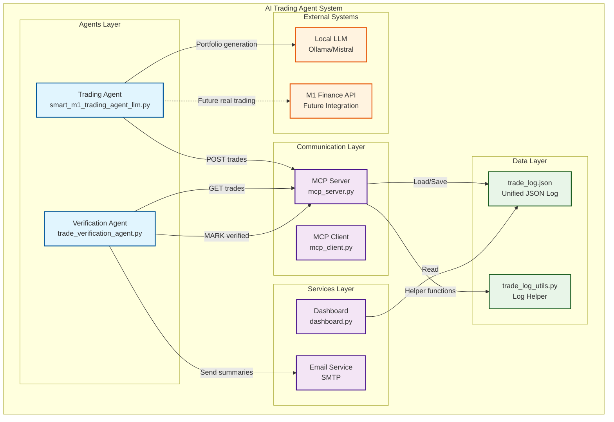

# AI Trading Agent System 🧠💹


An intelligent, agentic trading system featuring LLM-powered portfolio generation, automated trade verification, and real-time visualization. The system uses a Model Context Protocol (MCP) server for inter-agent communication, enabling a fully decoupled, scalable architecture.

## 🏗 System Architecture

### 📊 Visual Architecture Diagram




## 🎯 Key Features

### 🤖 **Intelligent Trading Agent**
- **LLM-Powered Portfolio Generation**: Uses local LLM (Mistral via Ollama) to generate dynamic investment portfolios
- **Simulated Trading**: Currently simulates trades with real trading API integration ready
- **JSON Logging**: Robust trade logging with automatic format migration and validation
- **MCP Integration**: Posts trades to MCP server for inter-agent communication

### 📬 **Automated Verification Agent**
- **Autonomous Operation**: Independently queries MCP for unverified trades
- **Email Summaries**: Sends comprehensive trade summaries via Gmail SMTP
- **Verification Tracking**: Marks trades as verified after email delivery
- **Agentic Architecture**: No direct dependencies on other components

### 🖥 **Real-Time Dashboard**
- **Interactive Visualization**: Dash/Plotly-based dashboard for trade analysis
- **Portfolio Tracking**: Real-time portfolio performance monitoring
- **Trade History**: Complete trade history with filtering and search
- **Performance Metrics**: Key performance indicators and analytics

### 🔄 **MCP Communication Hub**
- **Unified Interface**: Single point of communication for all agents
- **JSON Log Management**: Handles all trade log operations
- **RESTful API**: HTTP-based communication protocol
- **Error Handling**: Robust error handling and validation

## 📁 Project Structure

```
AItradingagent/
├── agents/
│   ├── trading_agent.py          # Main trading agent
│   └── verification_agent.py     # Verification and Notification agent
├── services/
│   └── dashboard.py              # Web dashboard
├── utils/
│   ├── mcp_server.py             # MCP communication server
│   ├── mcp_client.py             # MCP client utilities
│   └── trade_log_utils.py        # Log management helper
├── logging/
│   └── trade_log.json            # Unified trade log
├── aitrading.py                  # Unified start/stop script
└── requirements.txt              # Python dependencies
```

## 🚀 Quick Start

### 1. **Install Dependencies**
```bash
pip install -r requirements.txt
```

### 2. **Set Up Local LLM (Ollama + Mistral)**
```bash
# Install Ollama (if not already installed)
curl -fsSL https://ollama.ai/install.sh | sh

# Pull and run Mistral model
ollama pull mistral
ollama run mistral
```

### 3. **Configure Email (Optional)**
Set environment variables for email notifications:
```bash
export EMAIL_USER="your@gmail.com"
export EMAIL_PASS="your_app_password"
export EMAIL_TO="recipient@gmail.com"
```

### 4. **Run the System**
```bash
# Start all components
python aitrading.py start

# Or run components individually
python agents/smart_m1_trading_agent_llm.py    # Trading agent
python agents/trade_verification_agent.py      # Verification agent
python services/dashboard.py                   # Dashboard
python utils/mcp_server.py                     # MCP server
```

### 5. **Access Dashboard**
Open your browser to: `http://localhost:8050`

## 🔧 Configuration

### Environment Variables
```bash
# Email Configuration
EMAIL_USER=your@gmail.com
EMAIL_PASS=your_app_password
EMAIL_TO=recipient@gmail.com
EMAIL_HOST=smtp.gmail.com
EMAIL_PORT=587

# MCP Server Configuration
MCP_SERVER_URL=http://localhost:11534/mcp

# LLM Configuration
OLLAMA_URL=http://localhost:11434
```

### Logging Configuration
- **Log Location**: `logging/trade_log.json`
- **Log Format**: JSON with `{"new_trade": {...}, "trades": [...]}` structure
- **Auto Migration**: Legacy CSV logs automatically converted to JSON
- **Validation**: Automatic format validation and error recovery

## 🔄 System Workflow

1. **Trading Agent** generates portfolio recommendations using LLM
2. **Trading Agent** simulates trades and posts to MCP server
3. **MCP Server** stores trades in unified JSON log
4. **Dashboard** reads from log and displays real-time visualizations
5. **Verification Agent** queries MCP for unverified trades
6. **Verification Agent** sends email summaries and marks trades as verified

## 🛠 Development

### Adding New Agents
1. Create agent in `agents/` directory
2. Use `utils/mcp_client.py` for MCP communication
3. Follow existing patterns for logging and error handling

### Extending MCP Server
1. Add new prompts to `utils/mcp_server.py`
2. Update client utilities in `utils/mcp_client.py`
3. Document new functionality

### Customizing Dashboard
1. Modify `services/dashboard.py`
2. Add new visualizations using Plotly
3. Update layout and styling as needed

## 🐛 Troubleshooting

### Common Issues

**MCP Server Connection Errors**
```bash
# Test MCP server connectivity
curl -X POST http://localhost:11534/mcp \
  -H "Content-Type: application/json" \
  -d '{"prompt": "GET_LATEST_TRADES"}'
```

**Email Configuration Issues**
- Ensure 2FA is enabled on Gmail
- Use App Password, not regular password
- Check firewall settings for SMTP ports

**LLM Connection Issues**
```bash
# Test Ollama connectivity
curl http://localhost:11434/api/tags
```

**Log File Issues**
- Check write permissions in `logging/` directory
- Verify JSON format with `python -m json.tool logging/trade_log.json`

### Debug Mode
Enable debug logging by setting environment variable:
```bash
export DEBUG=1
```

## 🔮 Future Enhancements

- **Real Trading Integration**: M1 Finance API integration for live trading
- **Advanced Analytics**: Machine learning models for portfolio optimization
- **Multi-Exchange Support**: Support for multiple brokerage APIs
- **Risk Management**: Automated risk assessment and position sizing
- **Mobile Dashboard**: React Native mobile app for monitoring
- **Webhook Integration**: Real-time notifications via webhooks
